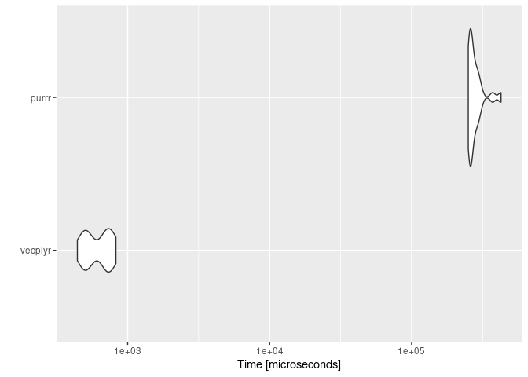
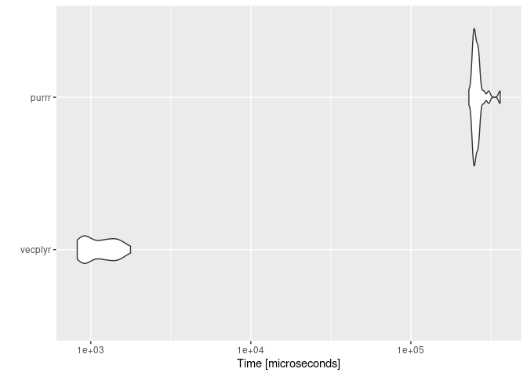

<!-- README.md is generated from README.Rmd. Please edit that file -->

# vecplyr

<!-- badges: start -->
<!-- badges: end -->

`vecplyr` extends 2 dplyr functions to vectors: `filter` and `mutate`.
They are inspire in `purrr` functions `modify` and `keep`/`discard`, but
much more efficient since only apply to vectors and vectorized
functions.

## Installation

You can install the development version of vecplyr from
[GitHub](https://github.com/) with:

``` r
# install.packages("devtools")
devtools::install_github("vituri/vecplyr")
```

## Usage

`vecplyr` has two main functions:

-   `v_filter` throw away some entries of a vector based on a condition;
-   `v_mutate` modifies a vector with a function when some condition is
    TRUE.

Suppose we want to do the following: given an integer vector `x`, we
want to: - keep only the even numbers of x; - add 1 to all numbers of
x; - multiply by -1 the numbers less than 25.

``` r
library(vecplyr)
#> Carregando pacotes exigidos: magrittr
x = 1:50

# vecplyr approach can be "piped"
x %>% 
  v_filter(\(x) x %% 2 == 0) %>% # keep the even
  v_mutate(\(x) x+1) %>% # sum 1
  v_mutate(\(x) -x, \(x) x < 25) # multiply by -1 only those that satisfy x < 25
#>  [1]  -3  -5  -7  -9 -11 -13 -15 -17 -19 -21 -23  25  27  29  31  33  35  37  39
#> [20]  41  43  45  47  49  51

# base R approach
y = x[x %% 2 == 0]
z = y + 1
w = z
id = w < 25
w[id] = - w[id]
w
#>  [1]  -3  -5  -7  -9 -11 -13 -15 -17 -19 -21 -23  25  27  29  31  33  35  37  39
#> [20]  41  43  45  47  49  51
```

## Examples

``` r
library(vecplyr)

x = 1:1e5

# get the sum of all odd numbers in x
x %>% v_filter(\(x) x %% 2 == 0) %>% sum()
#> [1] 2500050000

# get all numbers where the square of it is less than 10000
x %>% v_filter(\(x) x^2 < 10000)
#>  [1]  1  2  3  4  5  6  7  8  9 10 11 12 13 14 15 16 17 18 19 20 21 22 23 24 25
#> [26] 26 27 28 29 30 31 32 33 34 35 36 37 38 39 40 41 42 43 44 45 46 47 48 49 50
#> [51] 51 52 53 54 55 56 57 58 59 60 61 62 63 64 65 66 67 68 69 70 71 72 73 74 75
#> [76] 76 77 78 79 80 81 82 83 84 85 86 87 88 89 90 91 92 93 94 95 96 97 98 99

# take values from column b when a is NA
tibble::tibble(
  a = 1:10 %>% v_mutate(NA, \(x) x %% 2 == 0)
  ,b = -(1:10)
) %>% 
  dplyr::mutate(
    if_a_is_na_then_b = a %>% v_mutate(b, is.na)
  )
#> # A tibble: 10 × 3
#>        a     b if_a_is_na_then_b
#>    <int> <int>             <int>
#>  1     1    -1                 1
#>  2    NA    -2                -2
#>  3     3    -3                 3
#>  4    NA    -4                -4
#>  5     5    -5                 5
#>  6    NA    -6                -6
#>  7     7    -7                 7
#>  8    NA    -8                -8
#>  9     9    -9                 9
#> 10    NA   -10               -10
```

# Benchmark

Compared to `purrr` functions `keep` and `modify`, `vecplyr` is faster
because it only accepts vectors and vectorized functions.

``` r
x = 1:1e5

mbm = microbenchmark::microbenchmark(
  vecplyr = {
    x %>% v_filter(\(x) x^2 <= 5000)
  }
  ,purrr = {
    x %>% purrr::keep(\(x) x^2 <= 5000)
  }

  ,times = 25L
)
```

``` r
ggplot2::autoplot(mbm)
#> Coordinate system already present. Adding new coordinate system, which will replace the existing one.
```



``` r
x = 1:1e5

mbm2 = microbenchmark::microbenchmark(
  vecplyr = {
    x %>% v_mutate(\(x) x + 2, \(x) x <= 10000)
  }
  ,purrr = {
    x %>% purrr::modify_if(.f = \(x) x + 2L, .p = \(x) x <= 10000)
  }

  ,times = 25L
)
```

``` r
ggplot2::autoplot(mbm2)
#> Coordinate system already present. Adding new coordinate system, which will replace the existing one.
```


